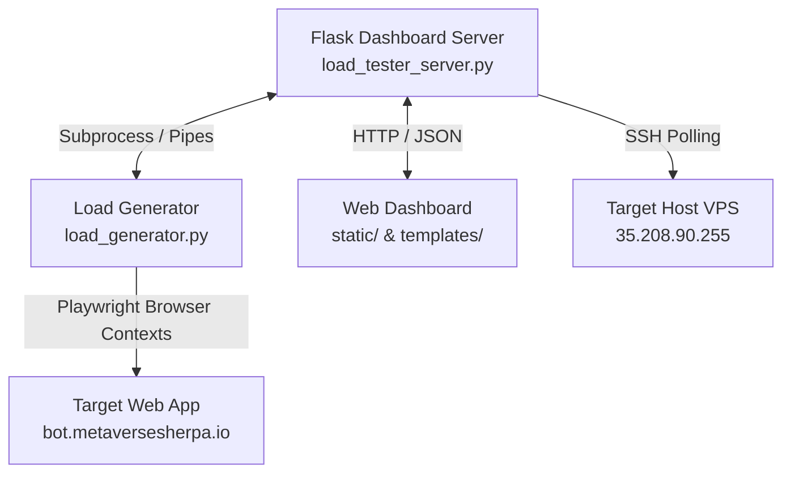

# Modern Browser-Based Load Tester with Real-Time Server Telemetry

This folder contains a complete, self-contained load-testing suite designed to simulate realistic user behavior using concurrent headless browsers. Unlike traditional protocol-level load testing tools (which only hit endpoints with raw HTTP requests), this tool executes client-side JavaScript, handles Zero-Knowledge cryptographic setups, interacts with authentication services (like Firebase), and measures real-world user-facing latency.

Additionally, it correlates user latencies with real-time target server CPU/Memory usage.

---

## Product Vision & Features

*   **Real-User Simulation**: Spawns multiple headless Chromium instances via Playwright to simulate actual web application page loads, navigation, button clicks, and form submissions.
*   **Zero-Knowledge & Client-Side JS Compliant**: Perfect for SPAs and secure applications that rely on client-side key generation, encryption, and client-side page rendering.
*   **Real-Time Server Telemetry**: Dynamically SSHs into the target server to parse CPU and memory usage (via `top` and `free`) during the load test, correlating server performance with load spikes.
*   **Interactive Web UI Dashboard**: A Flask-based web interface to edit testing configurations, trigger tests, monitor active workers, check real-time latency graphs, see target server metrics, and view step-by-step browser screenshots.
*   **Error Diagnostics**: Takes screenshot captures of the browser viewport on page errors or timeouts and outputs full console log dumps for diagnostic review.
*   **Throttling & Resource Optimizations**: Includes browser-level optimization arguments (disabled GPU, sandbox bypass, memory caps) and concurrency throttling semaphores to prevent CPU starvation on the host machine.

---

## Architecture

The product is split into three main components:



### 1. Flask Dashboard Server (`load_tester_server.py`)
- Orchestrates load generator runs using Python `subprocess.Popen`.
- Parses real-time logs from the load generator's stdout and exposes them via a SSE-like JSON API.
- Runs a background thread polling telemetry metrics from the target host.
- Serves the static assets and configuration endpoints.

### 2. Playwright Load Generator (`load_generator.py`)
- Reads the route configuration, sets up an asynchronous event loop, and schedules worker launches over a configurable ramp-up time.
- Uses `asyncio.Semaphore` to limit active browser instances running in parallel on the host system.
- Spawns headless browser pages, types fields, submits forms, verifies target elements, and logs latencies.

### 3. Server Monitor (`monitor_gcp.py`)
- Periodically runs lightweight, non-intrusive SSH commands against the target machine to read `/proc` statistics (`top -bn2` and `free`), returning CPU and RAM utilization metrics instantly.

---

## Infrastructure & Requirements

### Local Host Machine (where you run the Load Tester)
- **OS**: macOS, Linux, or Windows.
- **Python**: version 3.8 or higher.
- **Node/Browsers**: Playwright requires standard browser binaries (Chromium) downloaded to the system.
- **Hardware**: Spawning multiple Chromium browsers is CPU and RAM intensive. Recommended 8GB+ RAM. (A concurrency of 100 with a throttle of 4 active browsers runs comfortably on 2-core machines).

### Target Server Host
- **Access**: The monitoring script requires SSH access to the target host. The SSH key must be added to the ssh-agent on the local host machine, or SSH keyless login must be configured.
- **Command tools**: The host must support `top` and `free` commands under the SSH user context.

---

## Installation & Setup

1. **Set Up a Virtual Environment & Install Dependencies**:
   ```bash
   cd loadtester
   python3 -m venv venv
   source venv/bin/activate
   pip install -r requirements.txt
   ```

2. **Install Playwright Browsers**:
   ```bash
   playwright install chromium
   ```

3. **Configure SSH Access**:
   Make sure you can connect to the target server via SSH without a password prompt:
   ```bash
   ssh johngiles@35.208.90.255 "echo Connected"
   ```

4. **Launch the Load Tester Server**:
   ```bash
   python load_tester_server.py
   ```
   Open your browser and navigate to `http://localhost:8080` to access the dashboard.

---

## Configuration Schema

The test behavior is defined by a JSON configuration file (`load_test_config.json`):

```json
{
    "target_url": "https://bot.metaversesherpa.io",
    "concurrency": 12,
    "duration": 60,
    "ramp_up": 10,
    "premium_ratio": 0.2,
    "max_active_browsers": 4,
    "routes": [
        {
            "action": "navigate",
            "path": "/#/register",
            "screenshot": true
        },
        {
            "action": "navigate",
            "path": "/#/dashboard",
            "screenshot": true
        },
        {
            "action": "click",
            "selector": ".btn-primary",
            "screenshot": true
        }
    ]
}
```

*   `concurrency`: Total number of virtual user sessions to simulate.
*   `max_active_browsers`: Concurrency limit for active Playwright instances to prevent CPU thrashing.
*   `ramp_up`: Time in seconds to roll out the concurrent users.
*   `routes`: Array of steps that each virtual user will execute sequentially. Supported actions include `navigate`, `click`, `wait`, and `wait_for_selector`.

---

## Roadmap to a Standalone SaaS Product

To package this load tester into a commercial standalone developer tool, the following enhancements should be made:

1. **Remove Hardcoded Target IP/Credentials**:
   - Move the target SSH host (`35.208.90.255`) and SSH user (`johngiles`) out of `monitor_gcp.py` and into the config schema.
   - Support SSH password/private key configurations uploaded directly via the Dashboard Settings tab.
2. **Dockerization**:
   - Provide a `Dockerfile` enclosing Python, Flask, Node.js, and Playwright system dependencies so developers can run the suite with one command: `docker-compose up`.
3. **Multi-Node Distributed Load**:
   - Move from a local Playwright runtime to a distributed model. When a test is started, spin up temporary serverless containers (e.g. AWS Fargate or Google Cloud Run) to act as worker nodes. This allows simulating thousands of concurrent real-browser users without overloading the local host CPU.
4. **API Integration / CI/CD Support**:
   - Build a CLI endpoint to trigger tests headlessly via GitHub Actions or GitLab CI, returning a non-zero exit code if error thresholds or latency budgets are exceeded.
